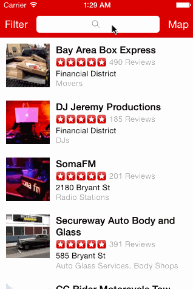

Yelp
=

A simple iOS 7 Yelp client. It allows you to search Yelp for businesses in San Francisco, with the option to sort and filter the results. It also displays the business locations on a map.

Time spent: 10-12 hours

Completed user stories
-

####Search results page
 * [x] Required: Table rows should be dynamic height according to the content height
 * [x] Required: Custom cells should have the proper Auto Layout constraints
 * [x] Required: Search bar should be in the navigation bar (doesn't have to expand to show location like the real Yelp app does).
 * [x] Optional: Implement map view of restaurant results

####Filter page
 * [x] Required: The filters you should actually have are: category, sort (best match, distance, highest rated), radius (meters), deals (on/off).
 * [x] Required: The filters table should be organized into sections as in the mock.
 * [x] Required: You can use the default UISwitch for on/off states.
 * [x] Required: Radius filter should expand as in the real Yelp app
 * [x] Required: Categories should show a subset of the full list with a "See All" row to expand.
 * [x] Required: Clicking on the "Search" button should dismiss the filters page and trigger the search w/ the new filter settings.

Notes
-

- The Yelp API stopped returning lat/long coordinates with search results, so for the map view I randomly generated locations within the region that the API returned :P
- My FilterViewController got pretty fat but I couldn't figure out a clean way to move away any of that logic. Suggestions would be appreciated!
- I'd also appreciate feedback on SearchFilters. I implemented the filters as enums to provide a clean separation from the display strings and search param strings, but it got really verbose. Is there a better pattern to do something like this?

Walkthrough
-

